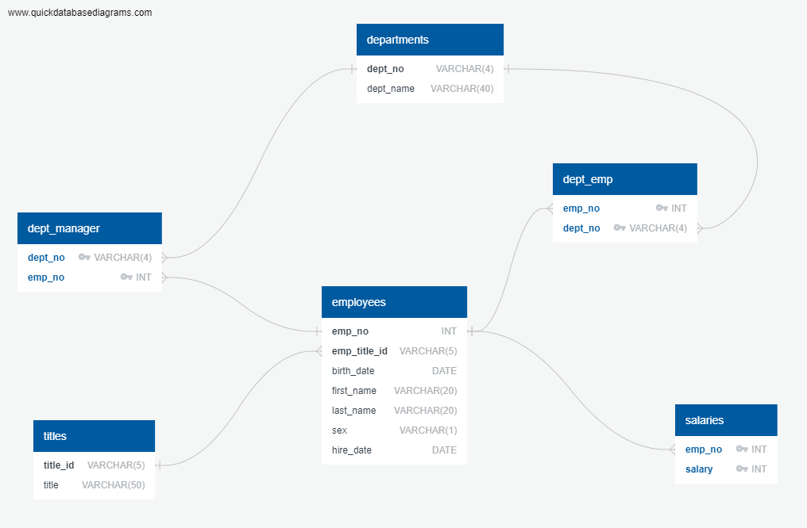

# SQL Analysis

## Website: 
[website](https://github.com/Damiomo/SQL-Analysis)

## Description
Created an ERD, schema and queries for six csv files holding employee's info

## Table of Contents
- [Installation](#installation)

- [Credits](#credits)
- [License](#license)
- [Features](#features)

- [Contact](#contact)

## Installation
postgresSQL

## Credits
Damilare Omoboriowo

## License
MIT

## Features
It provides analysis on employee's data

## Contact
If there are any questions or concerns, I can be reached at:
##### [github: Damiomo](https://github.com/Damiomo)
##### [email: Domoboriowo14@Gmail.com](mailto:Domoboriowo14@Gmail.com)
